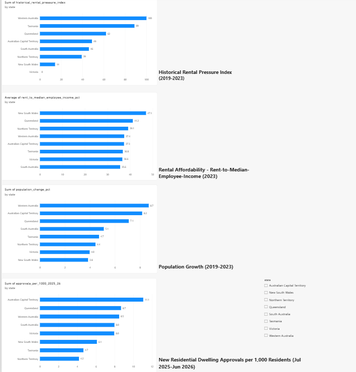

# Australian Rental Pressure Intelligence

A data-driven analysis of housing supply, population growth and rental affordability across Australian regions.

## Research Question

> What demographic, housing-supply and economic factors are associated with rental pressure across Australian regions, and how have these relationships changed over time?

## Project Overview

This project analyses publicly available Australian housing, population, income and building-approval data to investigate patterns associated with rental pressure across Australian states, territories and Statistical Areas Level 2 (SA2).

The project combines data engineering, statistical analysis, index construction, machine learning and interactive visualisation.

The analysis does not attempt to establish causal relationships or evaluate government housing policy. It investigates statistical associations between rental pressure and selected demographic, economic and housing-market variables.

## Technologies

- Python
- Pandas
- NumPy
- Scikit-learn
- Matplotlib
- PostgreSQL / SQL
- Power BI
- Jupyter Notebook
- Git / GitHub

## Data Sources

The project uses publicly available data from the Australian Bureau of Statistics (ABS), Australian Institute of Health and Welfare (AIHW), and Reserve Bank of Australia (RBA).

Major datasets include:

- ABS rental market data
- ABS Regional Population
- ABS Building Approvals
- ABS Data by Region income data
- 2021 Australian Census General Community Profile data
- AIHW rental stress information
- RBA cash-rate data

## Project Pipeline

```text
Australian public datasets
          ↓
      Python ETL
          ↓
   Data cleaning & validation
          ↓
       PostgreSQL
          ↓
      SQL analysis
          ↓
 ┌────────┴─────────┐
 ↓                  ↓
Statistics       ML models
 ↓                  ↓
 └────────┬─────────┘
          ↓
   Interactive dashboard
```

### Key Analysis
## Rental Trends

Rental trends were analysed across Australian states and territories between 2019 and 2023.

Median weekly rents increased across all eight states and territories during this period, although the magnitude of change varied.


## Rental Affordability

A project-created affordability measure was calculated as:
Annualised Median Weekly Rent
-------------------------------- × 100
Median Employee Income

The measure is used to compare changes in rental costs relative to employee income.

It is a project-created indicator and should not be interpreted as an official rental-stress measure.

## Population Growth

Population growth between 2019 and 2023 was analysed alongside changes in rental affordability.

The relationship was treated as exploratory because the analysis contains only eight state and territory observations.

## Housing Supply

Building approvals were analysed at SA2 level using:

New residential dwelling approvals per 1,000 residents

The approval period analysed was:

July 2025 – June 2026

Approvals represent planned/approved residential activity rather than completed housing supply.

## Historical Rental Pressure Index

A custom Historical Rental Pressure Index was developed using three indicators over the aligned 2019–2023 period:

- Rental growth
- Population growth
- Change in the rent-to-income affordability measure

The indicators were standardised and combined into a relative 0–100 index.

The index is a project-created analytical measure and is not an official Australian statistic.

## Machine Learning

SA2-level 2021 Census data was used to investigate whether demographic and economic characteristics could predict estimated weekly rental prices.

Two baseline models were evaluated:

- Linear Regression
- Random Forest Regression

The Random Forest model performed better under five-fold cross-validation.

| Model             | Mean MAE | Mean RMSE | Mean R² |
| ----------------- | -------: | --------: | ------: |
| Linear Regression |    37.17 |     58.06 |   0.694 |
| Random Forest     |    30.69 |     46.94 |   0.802 |

The Random Forest achieved a mean R² of approximately 0.80 across the five folds.

Model interpretation is predictive rather than causal. In particular, feature importance does not represent an independent causal effect.


## Dashboard

An interactive Power BI dashboard was developed to present the main findings.

The dashboard includes:

- Historical Rental Pressure Index (2019–2023)
- Rental Affordability (2023)
- Population Growth (2019–2023)
- New Residential Dwelling Approvals per 1,000 Residents (July 2025–June 2026)
- State/territory filtering

Dashboard file:

Australian_Rental_Pressure_Dashboard.pbix


## Limitations

Important limitations include:

- Different datasets cover different time periods.
- SA2 rental targets derived from Census rent bands are estimates.
- The affordability measure is project-created rather than an official rental-stress measure.
- The Historical Rental Pressure Index depends on selected indicators and weighting.
- State-level correlation analysis uses only eight observations.
- Machine-learning models are based on 2021 SA2 data.
- Random cross-validation does not explicitly account for spatial relationships between neighbouring regions.


## Future Improvements

Potential extensions include:

- Longer historical SA2-level rental data
- Rental vacancy and listings data
- Housing completion data
- Additional economic indicators
- Spatial cross-validation
- Additional machine-learning algorithms
- Hyperparameter optimisation
- Automated data-refresh pipelines
- Longitudinal SA2-level analysis
- Streamlit dashboard development


## Project Structure
```text

australian-rental-pressure/
│
├── data/
│   ├── raw/
│   ├── processed/
│   └── external/
│
├── src/
│   ├── ingestion/
│   ├── cleaning/
│   ├── analysis/
│   └── modelling/
│
├── sql/
├── dashboard/
├── notebooks/
├── results/
│   ├── figures/
│   └── tables/
│
├── docs/
│
├── README.md
├── PROJECT_PLAN.md
├── DATA_INVENTORY.md
├── RESULTS.md
├── requirements.txt
└── .gitignore
```

## Reproducibility

The project is structured so that the data-processing and analysis stages can be reproduced through the Python scripts contained in src/.

The processed datasets used for analysis are stored separately from the original raw data.

## Dashboard




## Author


Anish Kulkarni

Master of Information Technology
UNSW Sydney


